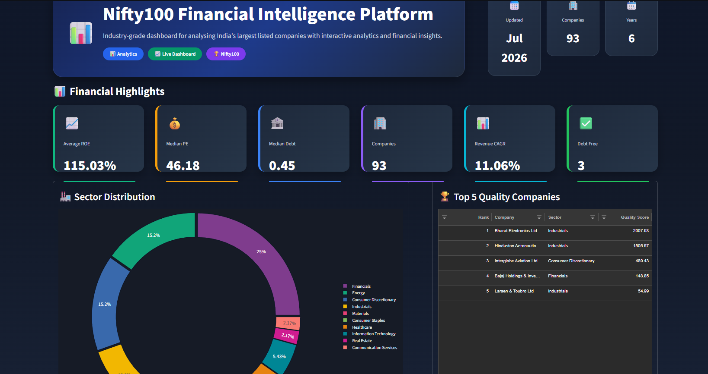
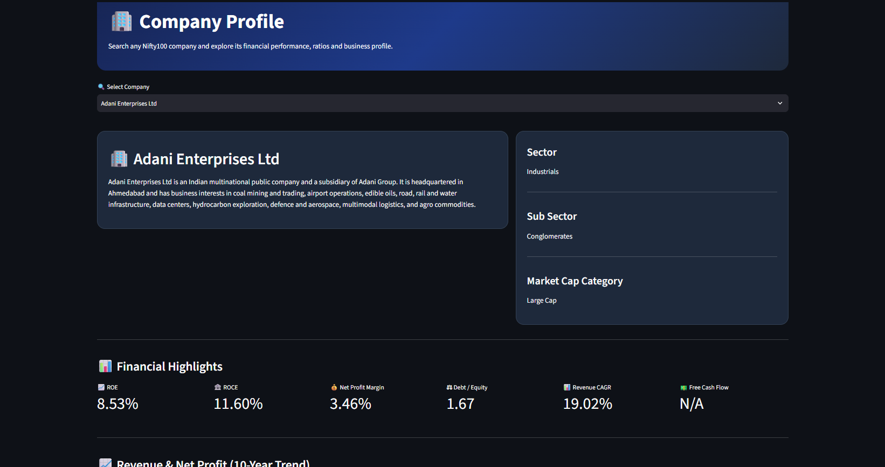
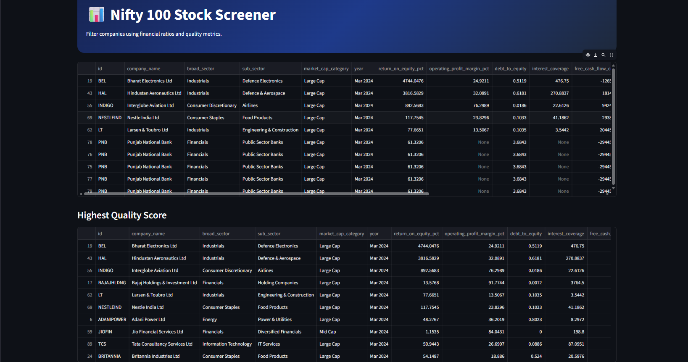
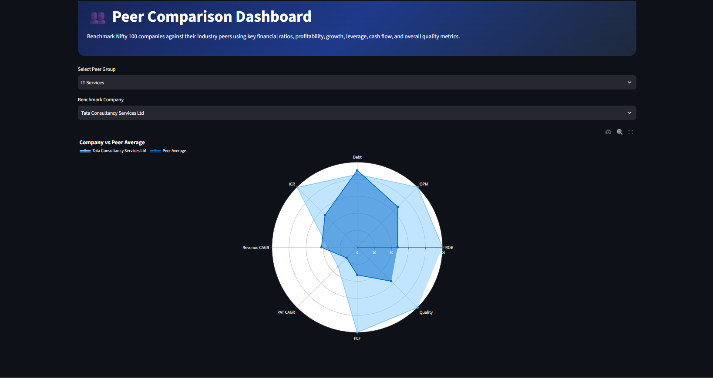
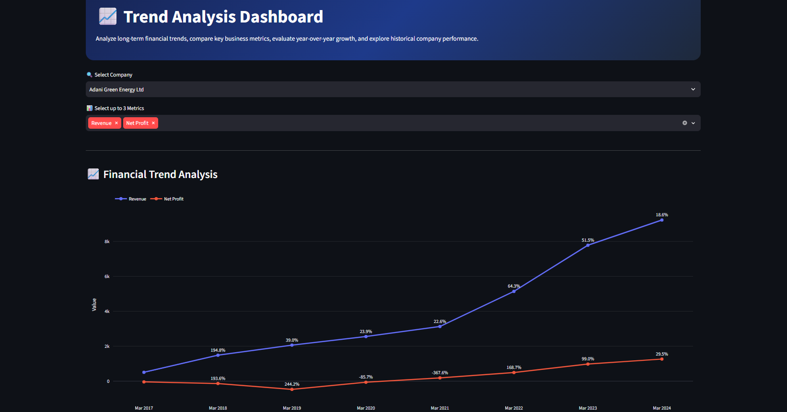
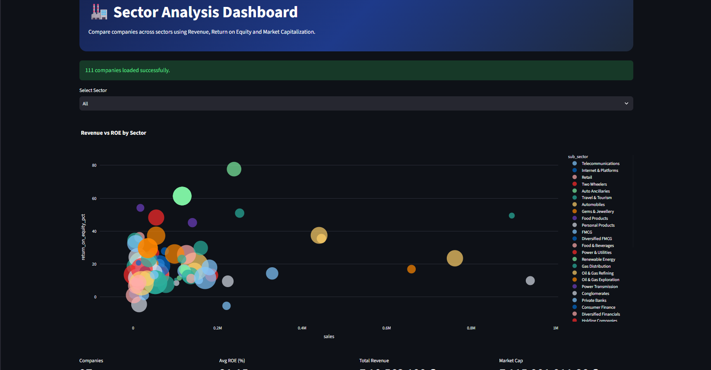
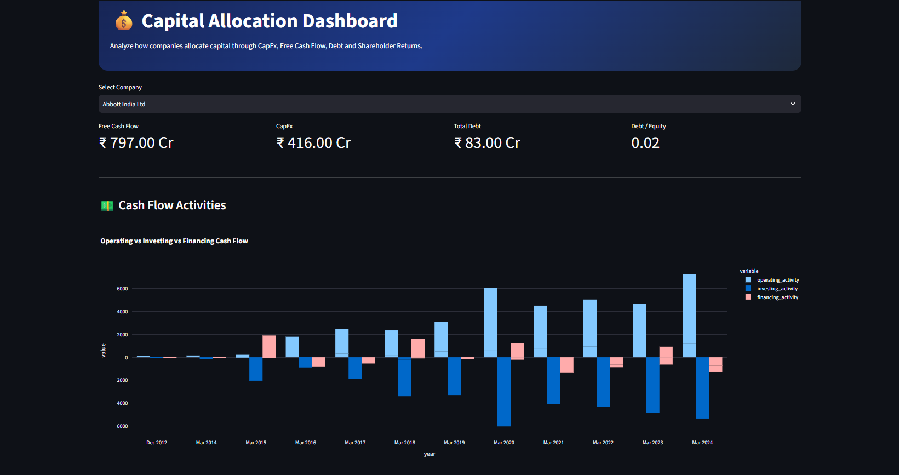
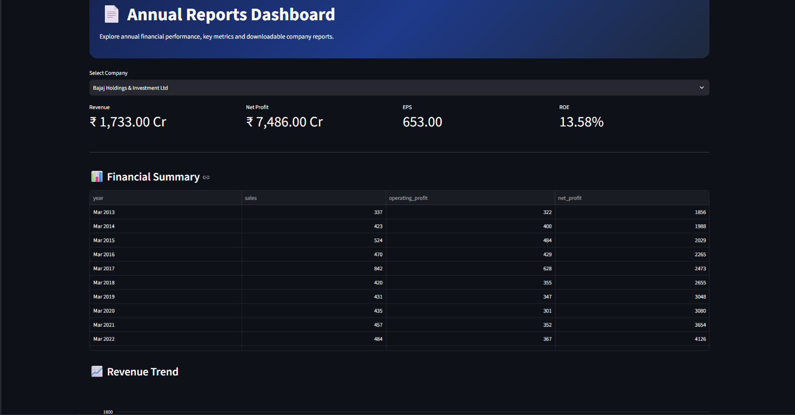

# 📊 Nifty100 Financial Intelligence Platform

An interactive **Financial Intelligence Dashboard** built with **Python, Streamlit, SQLite, Pandas, and Plotly** to analyze India's Nifty 100 companies. The platform provides financial insights through company profiling, stock screening, peer comparison, trend analysis, sector analytics, capital allocation analysis, annual reports, and valuation metrics.

---

## 🚀 Overview

The **Nifty100 Financial Intelligence Platform** is designed to simplify financial analysis by combining multiple dashboards into a single interactive application. It enables users to explore company fundamentals, compare peers, analyze historical trends, evaluate sector performance, monitor capital allocation, access annual reports, and perform valuation analysis.

---

## ✨ Features

- 📊 Interactive multi-page Streamlit dashboard
- 🏢 Company Profile Dashboard
- 🔍 Advanced Stock Screener
- ⚖️ Peer Comparison Dashboard
- 📈 Financial Trend Analysis
- 🏭 Sector Analysis
- 💰 Capital Allocation Dashboard
- 📄 Annual Reports Dashboard
- 📉 Valuation Analysis (PE Ratio & Free Cash Flow Yield)
- 📥 CSV & Excel Export Support
- ⚡ Fast data loading using Streamlit caching

---

# 🛠 Technology Stack

| Category | Technologies |
|----------|--------------|
| Language | Python |
| Framework | Streamlit |
| Database | SQLite |
| Data Processing | Pandas, NumPy |
| Visualization | Plotly |
| Version Control | Git & GitHub |

---

# 📂 Project Structure

```text
nifty100_financial_intelligence_platform/

├── pages/
│   ├── 01_home.py
│   ├── 02_profile.py
│   ├── 03_screener.py
│   ├── 04_peer_comparison.py
│   ├── 05_trends.py
│   ├── 06_sectors.py
│   ├── 07_capital.py
│   └── 08_reports.py
│
├── src/
│   ├── analytics/
│   │   └── valuation.py
│   │
│   └── dashboard/
│       ├── app.py
│       └── utils/
│           └── db.py
│
├── output/
│   ├── valuation_summary.xlsx
│   └── valuation_flags.csv
│
├── screenshots/
├── requirements.txt
└── README.md
```

---

# ⚙️ Installation

Clone the repository

```bash
git clone <repository-url>
```

Navigate to the project directory

```bash
cd nifty100_financial_intelligence_platform
```

Install dependencies

```bash
pip install -r requirements.txt
```

---

# ▶️ Run the Dashboard

```bash
streamlit run src/dashboard/app.py
```

---

# 📊 Dashboard Modules

## 🏠 Home Dashboard

Provides an overview of the Nifty100 dataset with financial highlights, sector distribution, and top-performing companies.



---

## 🏢 Company Profile

Displays company information, financial ratios, historical performance, financial highlights, and useful company links.



---

## 🔍 Stock Screener

Filter companies using financial ratios and quality metrics to identify fundamentally strong businesses.



---

## ⚖️ Peer Comparison

Compare companies with their industry peers using profitability, leverage, growth, and quality metrics.



---

## 📈 Trend Analysis

Visualize long-term revenue, profit, cash flow, and other financial trends with interactive charts.



---

## 🏭 Sector Analysis

Compare sectors using revenue, return on equity, market capitalization, and interactive bubble charts.



---

## 💰 Capital Allocation

Analyze Free Cash Flow, Capital Expenditure, Debt, Dividend trends, and cash flow activities.



---

## 📄 Annual Reports

Access financial summaries, historical performance, and annual report links for each company.



---

# 📈 Valuation Module

The valuation engine evaluates companies using:

- Price-to-Earnings (PE) Ratio
- Sector Median PE
- Free Cash Flow Yield
- Valuation Flags
- Discount Identification
- Caution Identification

### Generated Reports

- `output/valuation_summary.xlsx`
- `output/valuation_flags.csv`

---

# 📦 Deliverables

- Multi-page Streamlit Application
- Interactive Financial Dashboards
- Company Screening Module
- Valuation Engine
- SQLite Data Loader
- CSV Export
- Excel Report Generation

---

# ⚡ Performance

- Streamlit caching for improved performance
- Responsive Plotly visualizations
- Optimized SQLite queries
- Safe handling of missing values
- Interactive filtering across 90+ companies

---

# 🎯 Sprint 4 Highlights

- ✅ Built 8 interactive dashboard modules
- ✅ Implemented valuation analytics
- ✅ Added annual report integration
- ✅ Developed capital allocation analysis
- ✅ Created sector analytics dashboards
- ✅ Improved UI consistency
- ✅ Added export functionality
- ✅ Handled missing data gracefully
- ✅ Optimized dashboard performance

---

# 🔮 Future Enhancements

- Live NSE/BSE Market Data Integration
- Portfolio Tracking
- AI-based Investment Insights
- Financial Forecasting
- Technical Indicators
- News & Sentiment Analysis
- Watchlist & Alerts

---

# 👨‍💻 Author

**Raj Vijay Pawar**

💼 LinkedIn: https://www.linkedin.com/in/rajpawarkk11

💻 GitHub: https://github.com/rajpawarkk11

## ⭐ Support

If you found this project useful, consider giving it a ⭐ on GitHub.